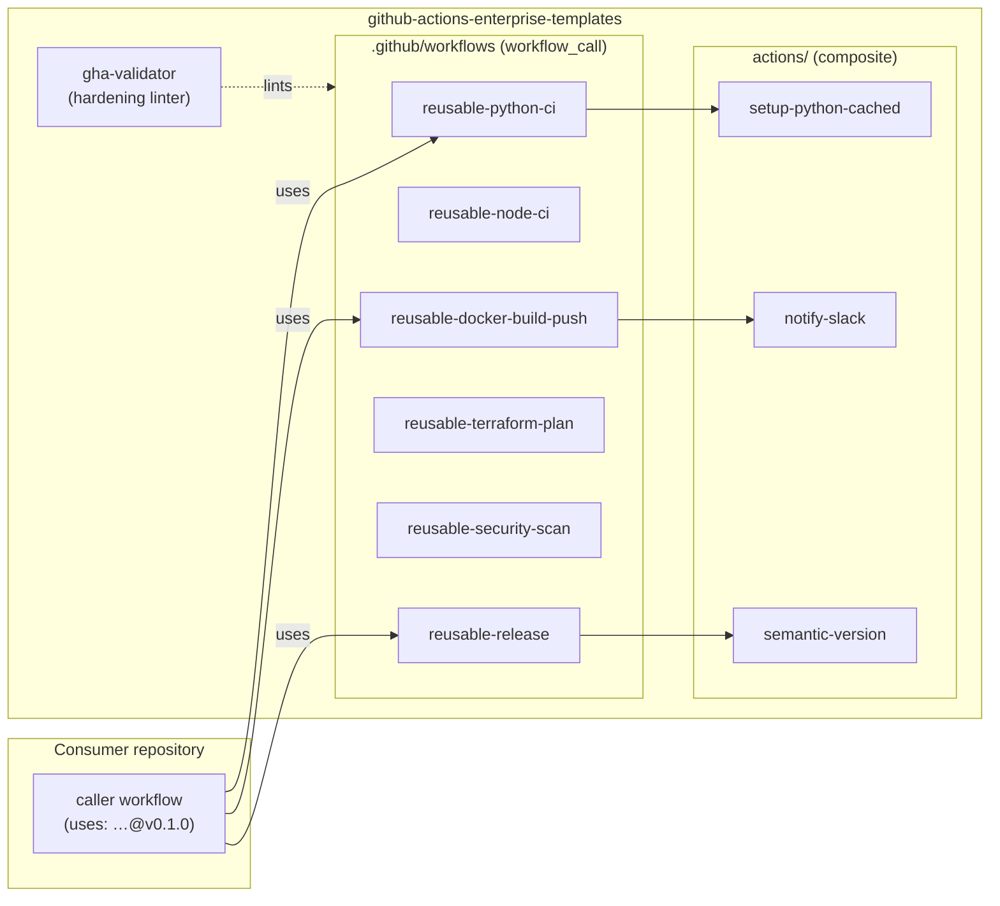

# GitHub Actions Enterprise Templates

A library of hardened, reusable GitHub Actions workflows, composite actions, and
a linter that keeps them secure — a house style for CI/CD you can call from any
repository.

[](LICENSE)
[](https://github.com/abhisheksawant52/github-actions-enterprise-templates/actions/workflows/ci.yml)
[](https://www.python.org/)
[](https://github.com/psf/black)
[](docs/catalog.md)

## Overview

Most CI/CD security and reliability incidents come from a handful of avoidable
mistakes: unpinned actions, over-broad `GITHUB_TOKEN` permissions, jobs with no
timeout, and pipelines with no concurrency control. Rewriting the same hardened
pipeline in every repository is how those mistakes creep back in.

This project solves that by centralizing the pipeline. It provides a set of
**reusable workflows** (callable via `workflow_call`) and **composite actions**
that consumer repositories reference by tag — so a fix or upgrade lands
everywhere at once. Each template is hardened by construction: least-privilege
`permissions`, pinned actions, per-job `timeout-minutes`, and typed
inputs/secrets/outputs.

To keep the library honest, it ships **`gha-validator`** (`gha-lint`), a small
Python linter that checks every workflow against the same hardening rules and
runs in this repo's own CI. It is aimed at platform and DevOps engineers who
want an enforceable, versioned standard for their organization's pipelines.

## Architecture



Components:

- **Reusable workflows** (`.github/workflows/reusable-*.yml`) — the callable
  building blocks for consumer pipelines.
- **Composite actions** (`actions/*/action.yml`) — small, focused steps reused
  across the workflows.
- **`gha-validator`** (`src/gha_validator/`) — the linter that enforces the
  hardening rules, with text/JSON/SARIF output.
- **Docs** (`docs/`) — the [catalog](docs/catalog.md) of every template and an
  [authoring guide](docs/authoring-guide.md).

## Features

- Six hardened reusable workflows: Python CI, Node CI, Docker build/push to
  GHCR, Terraform plan, security scanning (Trivy + CodeQL), and release tagging.
- Three composite actions: cached Python setup, semantic version computation,
  and Slack notifications.
- Every template uses least-privilege `permissions`, pinned actions, per-job
  `timeout-minutes`, and typed inputs/secrets/outputs.
- `gha-lint` linter enforcing four hardening rules, with SARIF output for GitHub
  code scanning.
- Self-linting CI that validates this repository's own workflows plus
  `actionlint`.

## Tech Stack

Python 3.11+ · Click · PyYAML · pytest · ruff · black · GitHub Actions ·
Docker Buildx · Terraform · Trivy · CodeQL

## Getting Started

### Prerequisites

- A GitHub repository that will consume the workflows.
- Python 3.11+ and `make` (optional) to run the linter locally.

### Use a reusable workflow

Add a caller workflow to your repository, referencing a pinned tag in
production:

```yaml
name: CI
on:
  push:
    branches: [main]
  pull_request:
    branches: [main]
permissions:
  contents: read
concurrency:
  group: ci-${{ github.ref }}
  cancel-in-progress: true
jobs:
  ci:
    uses: abhisheksawant52/github-actions-enterprise-templates/.github/workflows/reusable-python-ci.yml@v0.1.0
    with:
      python-versions: '["3.11", "3.12"]'
```

Build and push a container image to GHCR:

```yaml
jobs:
  image:
    permissions:
      contents: read
      packages: write
    uses: abhisheksawant52/github-actions-enterprise-templates/.github/workflows/reusable-docker-build-push.yml@v0.1.0
    with:
      image-name: ${{ github.repository }}
      push: ${{ github.ref == 'refs/heads/main' }}
    secrets:
      registry-token: ${{ secrets.GITHUB_TOKEN }}
```

See [`docs/catalog.md`](docs/catalog.md) for every workflow's inputs, secrets,
outputs, and usage snippets.

### Run the linter locally

```bash
python -m venv .venv && source .venv/bin/activate
make install                       # pip install -e ".[dev]"
gha-lint .github/workflows         # lint this repo's workflows
gha-lint .github/workflows --format sarif > gha.sarif
```

## Project Structure

```
.
├── .github/
│   ├── workflows/
│   │   ├── ci.yml                        # this repo's own pipeline
│   │   ├── reusable-python-ci.yml
│   │   ├── reusable-node-ci.yml
│   │   ├── reusable-docker-build-push.yml
│   │   ├── reusable-terraform-plan.yml
│   │   ├── reusable-security-scan.yml
│   │   └── reusable-release.yml
│   ├── ISSUE_TEMPLATE/
│   ├── CODEOWNERS
│   └── dependabot.yml
├── actions/
│   ├── setup-python-cached/action.yml
│   ├── semantic-version/action.yml
│   └── notify-slack/action.yml
├── src/gha_validator/                    # the gha-lint linter
│   ├── cli.py
│   ├── config.py
│   ├── rules.py
│   └── validator.py
├── tests/                                # pytest suite
├── docs/
│   ├── catalog.md
│   └── authoring-guide.md
├── pyproject.toml
└── Makefile
```

## Configuration

The linter is configured through CLI flags and one environment variable.

| Variable / Flag | Default | Description |
| --- | --- | --- |
| `--format` | `text` | Output format: `text`, `json`, or `sarif`. |
| `--fail-on` | `error` | Minimum severity that fails the run (`info`, `warning`, `error`). |
| `GHA_VALIDATOR_LOG_LEVEL` | `INFO` | Logging verbosity. |

Reusable workflows are configured through their `inputs` and `secrets`; each is
documented in [`docs/catalog.md`](docs/catalog.md).

## Deployment

These templates are consumed directly from GitHub — there is nothing to deploy.
Reference a reusable workflow or composite action from a consumer repository at
a pinned tag (e.g. `@v0.1.0`). Dependabot's `github-actions` ecosystem will open
PRs when a new tag is published, giving you a controlled upgrade path. The
`gha-lint` linter can additionally run in any pipeline to gate on hardening.

## Contributing

Contributions are welcome — see [CONTRIBUTING.md](CONTRIBUTING.md) and our
[Code of Conduct](CODE_OF_CONDUCT.md). New templates should follow the
[authoring guide](docs/authoring-guide.md) and pass `make validate`.

## Security

Please report vulnerabilities as described in [SECURITY.md](SECURITY.md).

## License

Released under the [MIT License](LICENSE).
